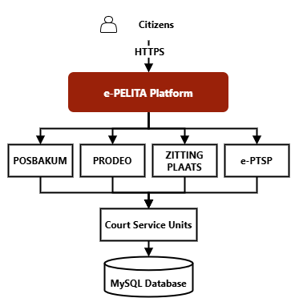
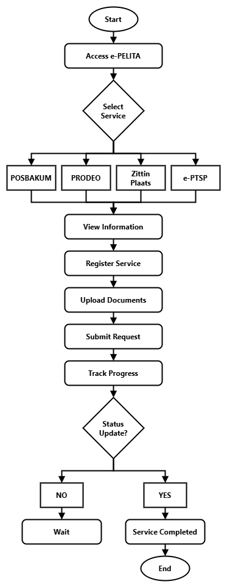

# e-PELITA
### elektronik - Pelayanan Hukum Bagi Masyarakat Tidak Mampu
[]()
[]()
[]()

> Portfolio showcase of a web-based public legal service platform developed to improve accessibility, transparency, and efficiency of court services through digital transformation initiatives.

---

## Overview

e-PELITA is an integrated public legal service management platform designed to centralize court-related public services into a unified web-based system.

The platform enables citizens to access legal aid services, submit service requests, upload supporting documents, track application progress, review service procedures, and access public court information online.

In addition to public-facing services, e-PELITA also provides administrative management features for service operators and system administrators to manage submissions, update service progress, control website content, and maintain public service information.

---

## Objectives

- Improve accessibility of court services
- Digitize public legal service workflows
- Reduce manual administrative processes
- Improve transparency of public service handling
- Provide centralized public legal service information
- Support digital transformation initiatives within court services

---

# Core Services

## POSBAKUM

Legal aid service module for underprivileged citizens.

### Features

- Online registration
- Submission tracking
- Supporting document upload
- Service procedures
- Legal service information
- Officer contact directory
- Individual services
- Organization services

---

## Prodeo Services

Fee-waived court service module.

### Features

- Online application
- Progress monitoring
- Supporting document upload
- Service requirements
- Public information access
- Officer contact directory

---

## Zitting Plaats

Circuit court service module.

### Features

- Service registration
- Submission management
- Progress tracking
- Supporting document upload
- Service procedures
- Public information access

---

## e-PTSP

Electronic One-Stop Integrated Public Services.

### Service Units

- Criminal Division
- Civil Division
- Legal Division
- General Administration
- Priority Services
- Complaints
- Public Information

### Features

- Service information portal
- Officer directory
- Service schedules
- Working hours
- Public information access
- Video information content

---

# Submission Workflow

Citizens can monitor the status of their service requests through several workflow stages:

```text
Submission Created → Accepted → Processing → Rejected / Completed
```

---

# Administrative System

e-PELITA includes an administrative management system with role-based access control.

---

## Super Admin Features

### User Management

- Create users
- Delete users
- Block users
- Reset passwords

### Content Management

- Landing page slideshow management
- Contact information management
- Footer link management
- Service detail management
- Procedure management
- Information management
- Consultant information management
- Gallery management
- e-PTSP profile management
- Video management
- Officer profile management

### Service Management

- View uploaded submission data
- Update submission progress
- Monitor service requests

---

## Service Admin Features

Service administrators are limited to their assigned service modules.

### Features

- View submission data
- Update submission progress
- Review uploaded documents

---

# System Architecture



---

# Service Workflow



---

# Key Features

## Public Features

- Integrated public legal service portal
- Online service registration
- Submission tracking
- Supporting document upload
- Public information access
- Service procedure guidance
- Officer contact directory
- Responsive web interface

---

## Administrative Features

- Role-based access control
- Multi-level administration
- Workflow management
- Submission management
- Content management
- Gallery management
- Video management
- Landing page management
- User management

---

# Technology Stack

## Backend

- Node.js
- Express.js

## Frontend

- HTML5
- CSS3
- JavaScript
- Bootstrap

## Database

- MySQL

## Infrastructure

- Linux Server
- HTTPS
- Session Management

---

# Screenshots

## Landing Page


---

## POSBAKUM Service


---

## Prodeo Service


---

## Zitting Plaats Service


---

## Submission Tracking


---

## e-PTSP Overview


---

## PTSP Service Officers


---

## Administrative Dashboard


---

# Project Highlights

- Government digital service platform
- Integrated legal service management
- Public service workflow system
- Role-based administrative system
- Content management capabilities
- Public submission tracking
- Court digital transformation initiative

---

## Project Status

Production System

---

## Ownership & Notice

This repository is maintained by Fernandy Maret Astriawan and published under the MarchTech brand.

The repository is intended exclusively for portfolio presentation, project documentation, and professional evaluation purposes.

Source code, production infrastructure, deployment configurations, sensitive data, proprietary implementation details, and operational data are not publicly available.

---

## License

All Rights Reserved.

See the LICENSE file for details.

© 2026 Fernandy Maret Astriawan — Developed under the MarchTech brand.
