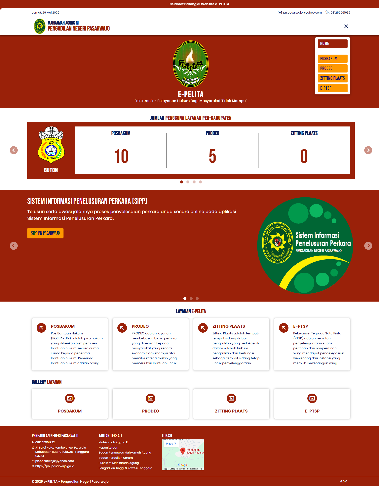
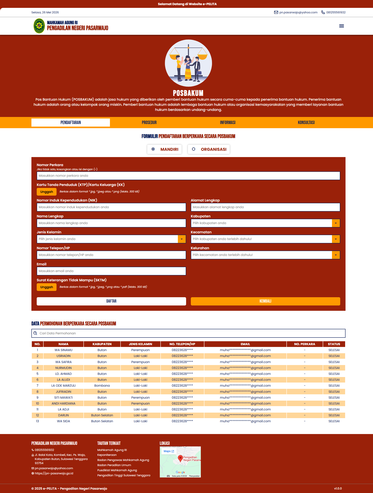
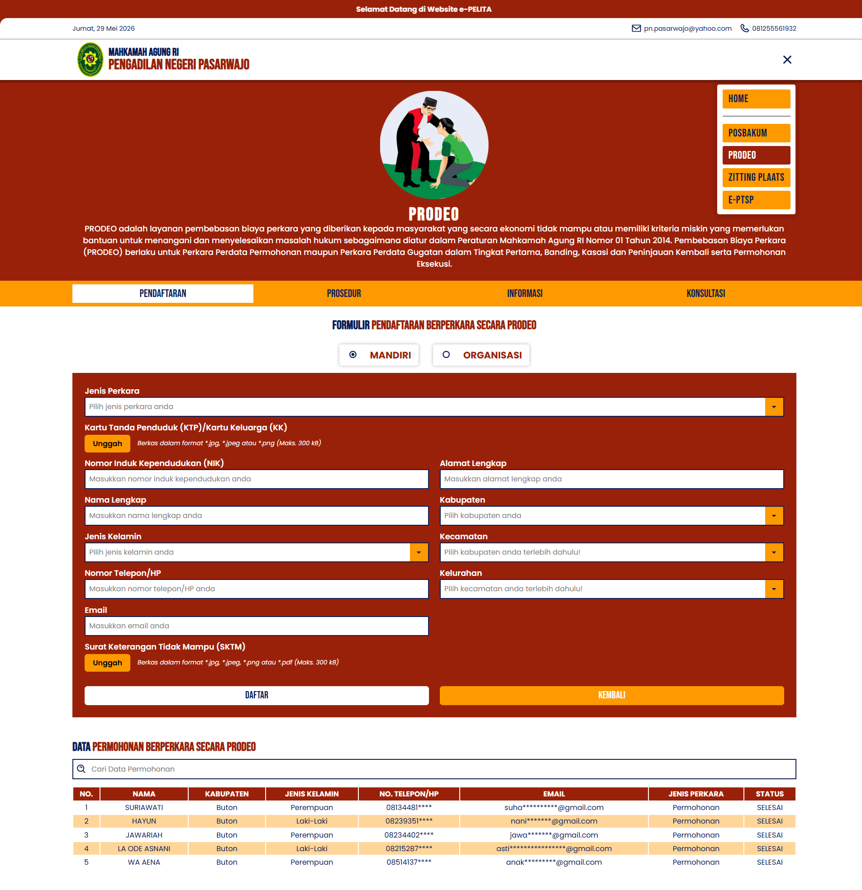
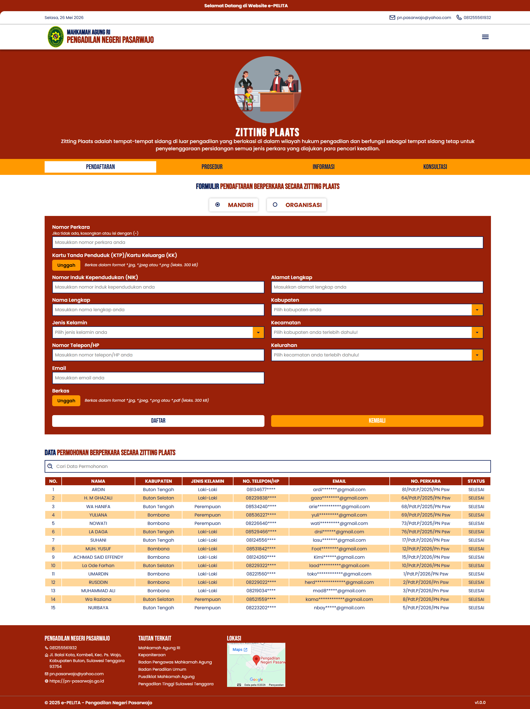
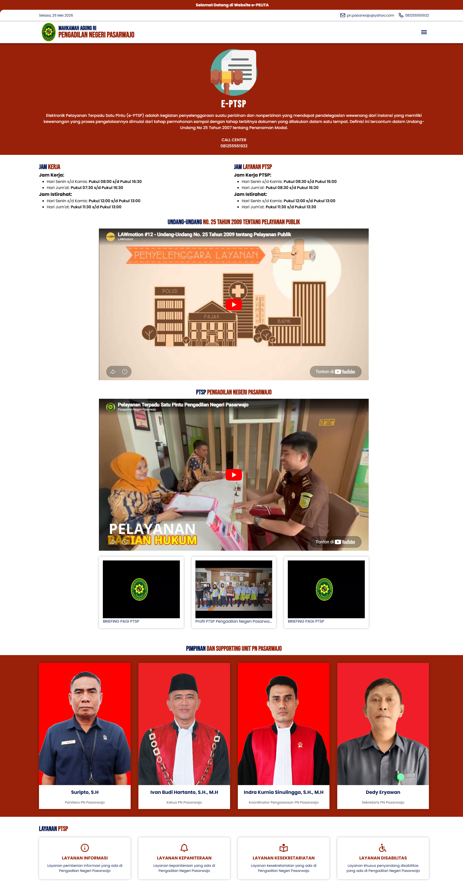
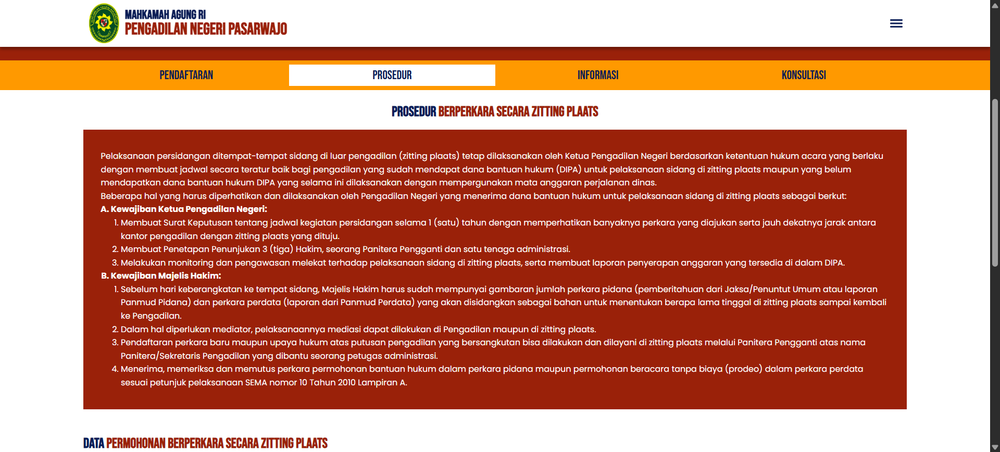
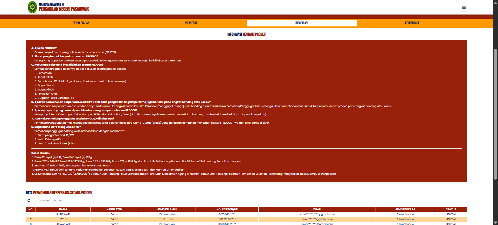
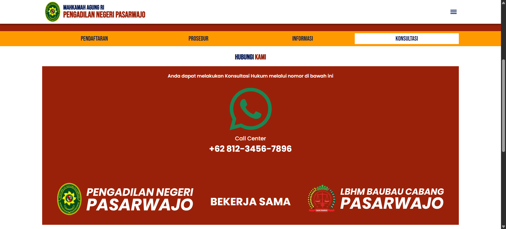

# e-PELITA
### elektronik - Pelayanan Hukum Bagi Masyarakat Tidak Mampu
[]()
[]()
[]()

> Portfolio showcase of a web-based legal service platform designed to improve public access to court information and services through digital channels.

---

## Overview

e-PELITA is a public-facing legal service platform developed to support digital transformation initiatives within the court environment.

The platform centralizes multiple legal and administrative services into a single portal, enabling citizens to access service information, procedures, registration forms, contact directories, and court-related assistance online.

---

## Objectives

- Improve accessibility of court services
- Provide centralized public service information
- Reduce barriers to legal assistance
- Improve service transparency
- Support digital transformation initiatives

---

## Core Services

### POSBAKUM

Legal aid information services for citizens.

Features:

- Service information
- Registration access
- Legal aid procedures
- Officer contact directory
- Individual services
- Organization services

---

### Zitting Plaats

Circuit court service information portal.

Features:

- Registration access
- Service procedures
- Contact information
- Public guidance

---

### Prodeo Services

Fee-waived court service information portal.

Features:

- Application guidance
- Service requirements
- Registration access
- Contact directory

---

### E-PTSP

Electronic One-Stop Integrated Services.

Service units include:

- Criminal Division
- Civil Division
- Legal Division
- General Administration
- Priority Services
- Complaints
- Public Information

---

## System Architecture

```text
Citizens
    │
    ▼
┌──────────────────────────┐
│         e-PELITA         │
│     Public Web Portal    │
└────────────┬─────────────┘
             │
 ┌───────────┼───────────┐
 │           │           │
 ▼           ▼           ▼

POSBAKUM  ZITTING    PRODEO
           PLAATS

             │
             ▼

          E-PTSP

             │
             ▼

      Court Service Units

             │
             ▼

         MySQL Database
```

---

## Service Workflow

```text
Citizen
   │
   ▼
Access e-PELITA
   │
   ▼
Choose Service
   │
   ├── POSBAKUM
   ├── Zitting Plaats
   ├── Prodeo
   └── E-PTSP
           │
           ▼
View Information
           │
           ▼
Review Procedures
           │
           ▼
Access Registration
           │
           ▼
Contact Officer
           │
           ▼
Receive Service
```

---

## Key Benefits

### For Citizens

- Easy access to legal service information
- Centralized public service portal
- Faster access to service procedures
- Direct communication channels with service officers

### For Court Administration

- Improved public information delivery
- Better service accessibility
- Reduced repetitive inquiries
- Support for digital public services

---

## Technology Stack

### Backend

- Node.js
- Express.js

### Frontend

- HTML5
- CSS3
- JavaScript
- Bootstrap

### Database

- MySQL

### Infrastructure

- Linux Server
- HTTPS
- Session Management

---

## Screenshots

### Landing Page



### POSBAKUM Service



### Prodeo Service



### Zitting Plaats Service



### e-PTSP Overview



### e-PTSP Service Officers


### Service Procedures



### Service Informations



### Service Contact Directory



---

## Project Status

Production System

---

## Ownership & Notice

This repository is maintained by Fernandy Maret Astriawan and published under the MarchTech brand.

The repository is intended exclusively for portfolio presentation, project documentation, and professional evaluation purposes.

Source code, production infrastructure, deployment configurations, sensitive data, proprietary implementation details, and operational data are not publicly available.

---

## License

All Rights Reserved.

See the LICENSE file for details.

© 2026 Fernandy Maret Astriawan — Developed under the MarchTech brand.
